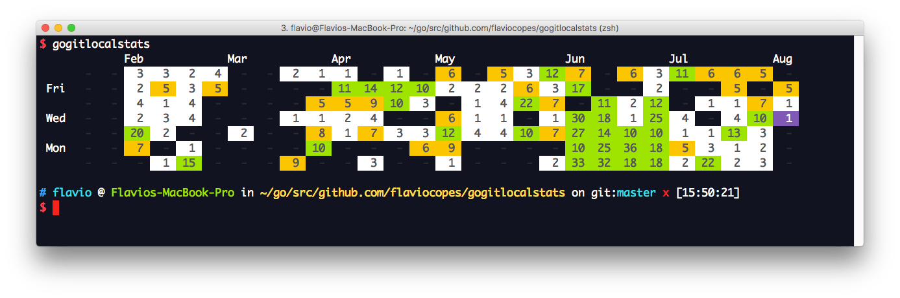

<h1 align="center">Welcome to gitlocalstats 👋</h1>
<p>
  
  <a href="a" target="_blank">
    
  </a>
  <a href="https://twitter.com/matdsoupe" target="_blank">
    
  </a>
</p>

## Description

A CLI tool to let you know how many contributions you made to your repositories, doesn't matter if it's on GitHub, GitLab or BitBucket! This means you have one source of proof!

<div align="center" width="30%">
  
</div>

## Install

```sh
  yarn install
```

## Usage

```sh
  tsc && node build/src/main.js <folder> <email>
```

## Author

👤 **Matheus <matheus_pessanha2001@outlook.com>**

* Twitter: [@matdsoupe](https://twitter.com/matdsoupe)
* Github: [@Mdsp9070](https://github.com/Mdsp9070)
* LinkedIn: [@mdsp](https://linkedin.com/in/mdsp)

## 🤝 Contributing

Contributions, issues and feature requests are welcome!<br />Feel free to check [issues page](https://github.com/Mdsp9070/gitlocalstats/issues).

## Show your support

Give a ⭐️ if this project helped you!

## 📝 License

Copyright © 2020 [Matheus <matheus_pessanha2001@outlook.com>](https://github.com/Mdsp9070).<br />
This project is [MIT](https://github.com/Mdsp9070/gitlocalstats/blob/master/LICENSE) licensed.

***
_This README was generated with ❤️ by [readme-md-generator](https://github.com/kefranabg/readme-md-generator)_
